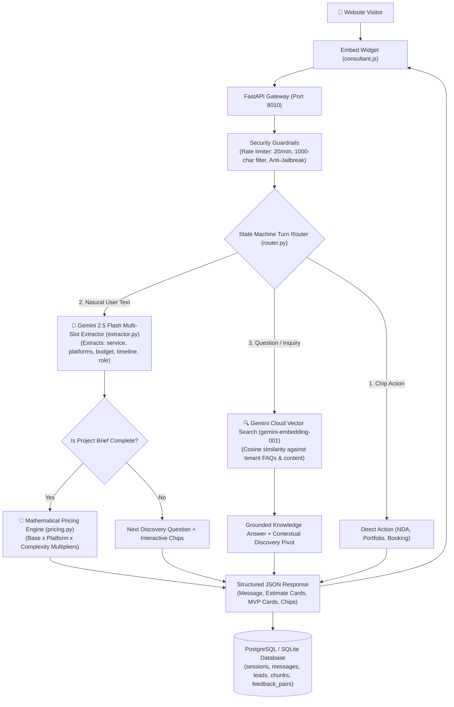

# Pre-Sales AI Consultant Bot — Master Documentation & Handover

> **Production AI Pre-Sales Agent**  
> **LLM Engine:** Google Gemini 2.5 Flash (Strict JSON Schema)  
> **Embeddings / RAG:** Google `gemini-embedding-001` (3072-dim cloud vectors)  
> **Backend Framework:** FastAPI (Python 3.11+, Async / Uvicorn)  
> **Deployment Targets:** Vercel (Serverless), Docker, or standalone VM  
> **Database:** SQLite (local dev) / PostgreSQL with pgvector (production)  

---

## 1. Project Overview & Business Purpose

This system is a **white-label, multi-tenant automated pre-sales consultant**. It embeds on client websites as a lightweight (<25KB) chat widget.

### What the bot does:
1. **Intelligent Discovery:** Gathers project requirements (service type, target platforms, project goal, feature list, timeline, budget band, and decision maker role).
2. **Deterministic Mathematical Pricing:** Calculates accurate price & timeline estimates using exact multiplier math from `pricing.yaml` — **zero hallucinated prices**.
3. **Semantic RAG & FAQ Retrieval:** Answers technical, workflow, and case-study questions using high-dimensional cloud embeddings.
4. **Objection Handling:** Handles price/timeline/offshore objections with brand-aligned approved scripts.
5. **Live Google Calendar Booking:** Queries real-time `freebusy` slots via Google Calendar API (OAuth 2.0) and creates Google Meet invites.
6. **Lead Analytics & Slack Notifications:** Scores leads (Hot / Warm / Cold), tracks conversation drop-offs, and pushes real-time lead alerts to team Slack channels.

---

## 2. Architecture & Data Flow



---

## 3. Major Upgrades & Codebase Improvements (Changelog)

This codebase has undergone a major production upgrade:

| Component | Previous State | Upgraded State |
| :--- | :--- | :--- |
| **LLM Model** | Invalid model `gemini-3.8-flash` | **`gemini-2.5-flash`** with strict JSON Schema mode and REST client |
| **Embedding Engine** | Primitive SHA-256 hash embedder on Vercel (failed on all semantic searches) | **`gemini-embedding-001`** cloud API with 3072-dim vectors, sub-batching (50 texts), and exponential 429 backoff |
| **Slot Extraction** | Brittle regex string matching (`if "mobile" in text`) causing dead loops | **`agents/extractor.py`** LLM multi-slot parser extracting full project scope from natural sentences in a single turn |
| **Uncertainty Handling** | Saying *"not sure"* triggered infinite question loops | Graceful fallback defaults (e.g. assumes \$15–40k baseline and moves forward) |
| **Message Security** | 4000-char input limit (high abuse risk) | **1000-character hard limit** enforced on backend (`sessions.py`) and widget (`consultant.js`) |
| **Session Lifecycle** | Sessions accumulated forever in DB | **7-day Session TTL (`expires_at`)** with HTTP 410 Gone status and auto-reset |
| **Widget Polish** | Raw text rendering | **Markdown formatting** (`**bold**`, lists, links) + **`localStorage` session memory** across page refreshes |
| **Test Coverage** | Partial test suite | **44 automated pytest cases** covering all critical flows with 100% pass rate |

---

## 4. Multi-Tenant Folder Structure

Each client/brand is configured as an isolated tenant under `tenants/<slug>/`:

```
pre-sales-bot/
├── backend/
│   ├── app/
│   │   ├── agents/          # Router, Brief state machine, Multi-slot extractor, Fallbacks
│   │   │   ├── brief.py     # ProjectBrief schema and discovery field definitions
│   │   │   ├── extractor.py # Gemini 2.5 Flash natural language multi-slot parser
│   │   │   ├── router.py    # Fixed-priority turn decision tree
│   │   │   └── suggestions.py # LLM suggestion chip generator
│   │   ├── api/             # FastAPI routers (sessions, health, admin, public_config, documents)
│   │   ├── core/            # LLM client, Guardrails, Security/Rate-limiting, Settings
│   │   ├── engines/         # Pricing, MVP, Architecture, Calendar, Objections, Qualification
│   │   ├── models/          # SQLAlchemy DB models (TenantRow, SessionRow, MessageRow, LeadRow, ChunkRow)
│   │   └── rag/             # Vector store, chunking, embeddings (Gemini cloud), grading
│   └── tests/               # 44 automated pytest test suites
├── config/
│   └── platform.yaml        # Chunk size, overlap tokens, score floors (FAQ: 0.82, RAG: 0.55)
├── tenants/
│   └── demo/                # Tenant configuration folder (e.g., Northline / Acme)
│       ├── brand.yaml       # Theme colors, widget title, launcher text, logo
│       ├── faqs.yaml        # Screening FAQs with exact answers
│       ├── pricing.yaml     # Currency, base prices, platform/integration multipliers
│       ├── services.yaml    # Service catalog (Mobile, Web, AI, UI/UX)
│       ├── portfolio.yaml   # Case studies and past client work
│       ├── objections.yaml  # Sales objections and pre-approved replies
│       └── content/         # Markdown/PDF/DOCX knowledge files (case studies, whitepapers)
├── widget/
│   └── consultant.js        # Vanilla JS embed widget (<25KB, zero dependencies)
├── public/                  # Static assets and synced public widget
├── .env.example             # Environment variable template
└── requirements.txt         # Python dependencies
```

---

## 5. Environment Variables (`.env`)

Create `.env` inside `pre-sales-bot/`:

```env
ENVIRONMENT=development
PORT=8010
DATABASE_URL=sqlite:///./backend/presales.db

# Admin Dashboard
ADMIN_USERNAME=admin
ADMIN_PASSWORD=admin123
CORS_ORIGINS=http://localhost:8010,http://127.0.0.1:8010,https://dummy-web-portal-ten.vercel.app

# Google Gemini API
LLM_PROVIDER=gemini
LLM_API_KEY=AIzaSy...your_gemini_key
LLM_MODEL=gemini-2.5-flash

# Embeddings
EMBEDDING_BACKEND=gemini
EMBEDDING_MODEL=gemini-embedding-001

# Rate Limits & Token Caps
MESSAGE_RATE_LIMIT=20
MESSAGE_RATE_WINDOW_SECONDS=60
LLM_CALLS_PER_SESSION=30
LLM_CALLS_PER_IP_PER_HOUR=80
```

---

## 6. How to Run & Test Locally

### 1. Start Backend Server:
```bash
cd pre-sales-bot
python3 -m venv .venv
source .venv/bin/activate
pip install -r requirements.txt
uvicorn backend.app.main:app --reload --port 8010
```

### 2. Open in Browser:
* **Chatbot Widget:** [http://localhost:8010/](http://localhost:8010/)
* **Admin Dashboard:** [http://localhost:8010/admin](http://localhost:8010/admin) *(User: `admin`, Pass: `admin123`)*
* **API Health Check:** [http://localhost:8010/health](http://localhost:8010/health)

### 3. Run Automated Tests:
```bash
.venv/bin/pytest backend/tests -v
```
*(All 44 test cases will execute and verify the full system in ~4 seconds).*

---

## 7. How to Embed on Any Website

Embed this single script tag in the HTML of any website:

```html
<script src="https://YOUR_BOT_DOMAIN/widget/consultant.js"
        data-api="https://YOUR_BOT_DOMAIN"
        data-tenant="demo"
        async></script>
```

---

## 8. Critical Rules for Future AI Agents & Developers

1. **Deterministic Pricing Guardrail:** NEVER let the LLM generate project prices or durations. All financial quotes MUST come strictly from `pricing.py` and `pricing.yaml`.
2. **Context Trimming:** NEVER pass full raw conversation history to LLM calls. Always pass `summary (max 80 words) + last 3 turns` to prevent token bloat and keep latency <500ms.
3. **Embeddings:** On Vercel / serverless, DO NOT import PyTorch or `sentence-transformers`. Always use the lightweight REST API client (`gemini-embedding-001` or `text-embedding-004`).
4. **Widget Sync:** Whenever you modify `widget/consultant.js`, ALWAYS sync the changes to `public/widget/consultant.js` using `cp widget/consultant.js public/widget/consultant.js`.
5. **Testing Discipline:** Always run `.venv/bin/pytest backend/tests` after any change to ensure 100% test pass rate before committing.
